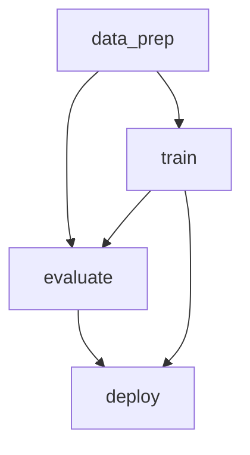

# ML 학습 워크플로우 실패 진단 에이전트

ML 학습 잡(PyTorch)이 실패했을 때, 로그·메트릭을 입력받아 **원인을 분석하고 다음 액션을 제안**하는 도구.

- **(1) 워크플로우 설계 문서** — [`docs/workflow-design.md`](docs/workflow-design.md)
- **(2) 워크플로우 PoC (DVC)** — `dvc.yaml` + `mljob/`
- **(3) 진단 AI 에이전트 (핵심, Rust)** — _작업 예정_
- **(4) 회고 로그** — 아래 [회고](#회고-로그) 섹션 (작성 예정)

---

## 파이프라인 DAG

`data_prep → train → evaluate → deploy`. DVC가 stage 의 `deps↔outs` 를 매칭해 그래프를 자동 구성한다.



> 위 그림은 `dvc dag --mermaid` 출력이다. ASCII(`dvc dag`), Graphviz(`dvc dag --dot`) 로도 볼 수 있다.

---

## 디렉터리 규칙: 커밋 vs 실행 산출물

> **이름이 `.`(dot)으로 시작하면 "실행하면 생기는 것" → git ignore. 그 외 전부 = 커밋.**

| 분류 | 경로 | 설명 |
|---|---|---|
| 커밋(소스) | `mljob/`, `dvc.yaml`, `scripts/`, `docs/` | 손으로 작성한 것 |
| 커밋(고정 입력) | `scenarios/{nan,shape,overfit}/` | (3) 에이전트가 분석할 **실제 실패 로그** (고정본) |
| 생성(ignore) | `.data/`, `.artifacts/`, `.runs/`, `.venv/`, `.dvc/cache` | `dvc repro`/학습이 만들어내는 것 |

---

## 실행 방법

### 옵션 A. 로컬 (uv)

```bash
uv sync                      # Python 3.12 + CPU torch + dvc 설치 (uv.lock 고정)
uv run dvc repro             # 전체 파이프라인 실행 (data_prep→train→evaluate→deploy)
uv run dvc dag               # DAG 시각화 (ASCII)
uv run dvc metrics show      # 각 stage 메트릭 표
./scripts/make_failure_logs.sh   # 실패 시나리오 3종 재생성 → scenarios/
```

### 옵션 B. Docker (로컬 의존성 0)

```bash
docker build -t narnia-wf .                         # 최초 빌드 수 분(CPU torch), 이후 캐시
docker run --rm narnia-wf                            # 전체 파이프라인 (dvc repro)
docker run --rm narnia-wf dvc dag                    # DAG
docker run --rm narnia-wf python -m mljob.train --fault nan   # 단일 실패 시나리오
```

> 최초 실행 시 FashionMNIST(~30MB)를 받는다. 전체 파이프라인은 CPU에서 ~30초.

---

## 재현 가능한 실패 시나리오 (= (3) 에이전트 입력)

`mljob/train.py` 의 `--fault` 플래그로 정상 학습과 3가지 실패를 **하나의 코드**로 생성한다.
덕분에 정상/실패 로그가 동일한 스키마(`train.log` + `metrics.json`)로 떨어진다.

| 시나리오 | 트리거 | 관측 신호(에이전트가 보는 것) |
|---|---|---|
| **nan** | 학습률 과대(lr=12) | `loss=nan`, `grad_norm` 폭증, `error.type=FloatingPointError`, `config.lr` |
| **shape** | FC 입력 차원 불일치 | `RuntimeError: mat1 and mat2 ... (64x1568 and 784x128)`, `error.phase=training_step` |
| **overfit** | 극소 데이터(200) + 과대 epochs | 크래시 없음. `history` 에서 train_loss↓ / val_loss↑ 갭 |

각 시나리오 산출물: `scenarios/<name>/train.log`(비정형) + `scenarios/<name>/metrics.json`(구조화).
스키마 정의는 [`mljob/telemetry.py`](mljob/telemetry.py).

---

## 사용한 AI 도구

- _작성 예정_

## 회고 로그

- _작성 예정 ((3) 완료 후)_

## 실제 투입 시간

- _집계 예정_
